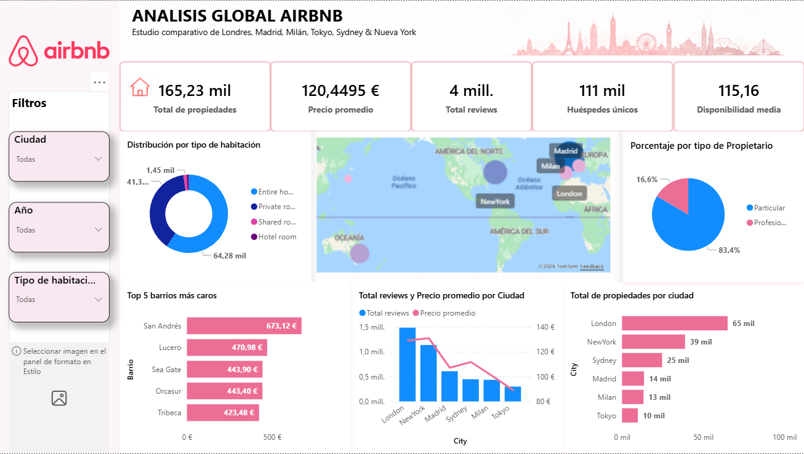
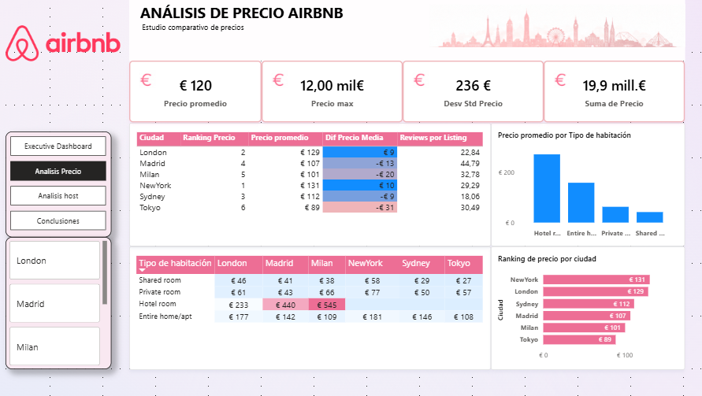
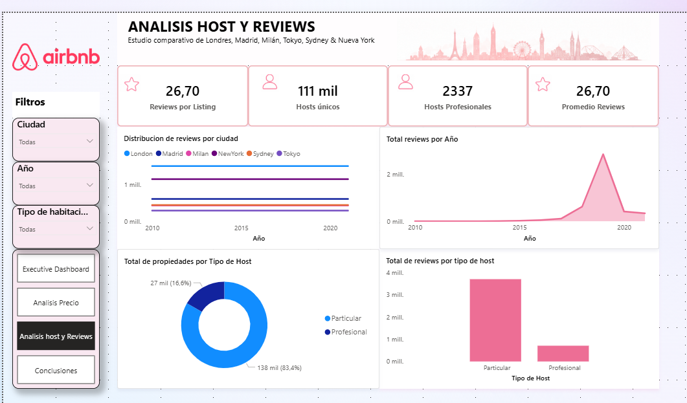
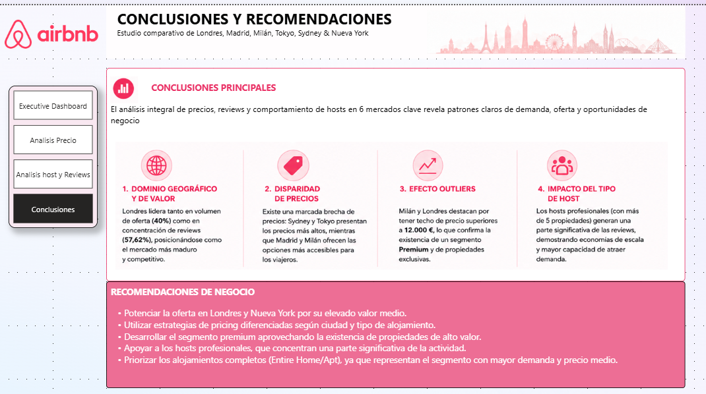

# Airbnb Global Markets Analytics

Business Intelligence project developed with Power BI to analyse Airbnb markets across six international cities through data transformation, modelling and interactive dashboards.

<p align="left">
  
  
  
  
  
  
</p>

---

## Project Overview

This project explores Airbnb listings across multiple international markets with the objective of identifying pricing patterns, host behaviour and market differences through Business Intelligence techniques.

The project includes:

- Data extraction and transformation (ETL)
- Data modelling
- KPI creation
- Interactive dashboard development
- Business insights generation

---

## Collaborative Project

This project was developed collaboratively by a team of three Data Analysts as part of a Data Analytics training program.

### Team Members

The team participated in different stages of the project including:

- Data preparation and cleaning
- Power Query transformations
- Data modelling
- Dashboard design
- KPI definition
- Business analysis
- Documentation and presentation

---

## Technologies Used

- Power BI
- Power Query
- DAX
- CSV Files
- Markdown

---

## Markets Included

The analysis covers Airbnb data from the following international cities:

- Madrid
- Milan
- New York
- Sydney
- Tokyo
- London

---

## Data Preparation and ETL

The original datasets contained typical inconsistencies found in distributed transactional systems:

- Different currencies
- Missing values
- Inconsistent text formats
- Non-standardized structures
- Incorrect data types

The ETL process was performed using Power Query and included:

### Currency Standardization

All financial metrics were converted to Euros (€) to enable valid cross-market comparisons.

### Data Cleaning

- Removal of currency symbols
- Removal of special characters
- Numeric conversion of financial fields
- Standardization of text values

### Missing Value Management

- Treatment of null values
- Replacement of missing categorical values
- Application of business rules for quantitative variables

### Data Consolidation

All city datasets were merged into a unified analytical model while preserving city-level traceability.

---

## Data Model

A consolidated data model was created to enable comparative analysis between different Airbnb markets.

Key analytical dimensions include:

- City
- Property Type
- Room Type
- Host Information
- Pricing Metrics
- Review Metrics

---

## Dashboard Sections

### Global Market Overview

Executive dashboard presenting key KPIs and market comparisons.



---

### Pricing Analysis

Analysis of pricing behaviour, average prices, reviews and neighbourhood performance.



---

### Host Analysis

Analysis of host characteristics and listing behaviour.



---

### Conclusions

Summary of key findings and business recommendations.



---

## Key Insights

The analysis revealed several relevant patterns across markets:

- Significant pricing differences exist between cities.
- Host behaviour varies depending on market maturity.
- Property type strongly influences listing prices.
- Review volume does not always correlate with higher pricing.
- Some neighbourhoods consistently outperform city averages.

---

## Business Value

This dashboard can support decision-making for:

- Travel and tourism companies
- Property investors
- Market analysts
- Hospitality businesses
- Digital accommodation platforms

---

## Repository Contents

```text
airbnb-global-markets-powerbi
│
├── assets/
│   ├── Analisis_global.png
│   ├── Analisis_precio.png
│   ├── Analisis_host.png
│   └── Conclusiones.png
│
├── dashboard/
│   └── airbnb_global_market.pbix
│
├── README.md
│
└── .gitignore
```

---

## Dashboard Access

The Power BI dashboard can be explored through the included `.pbix` file.
